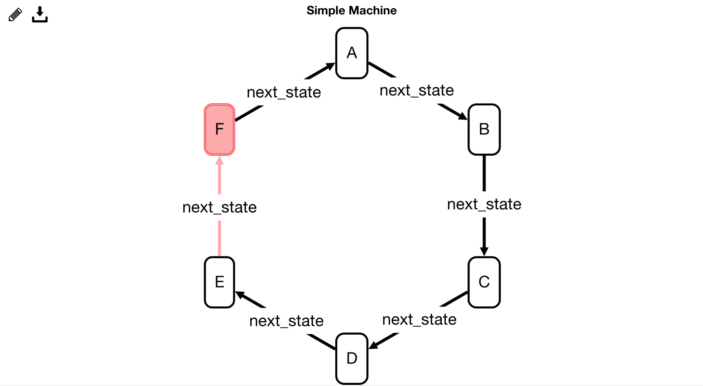
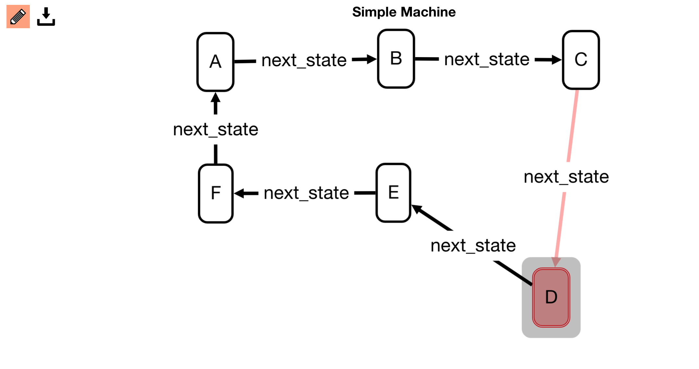
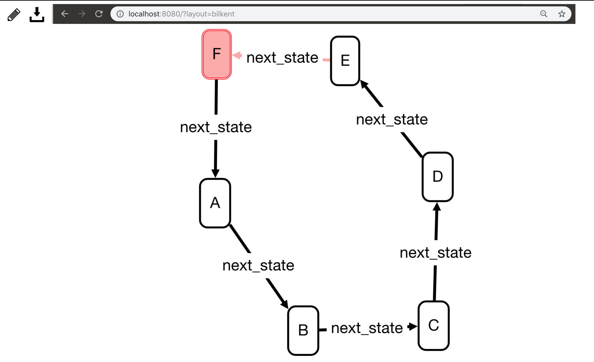
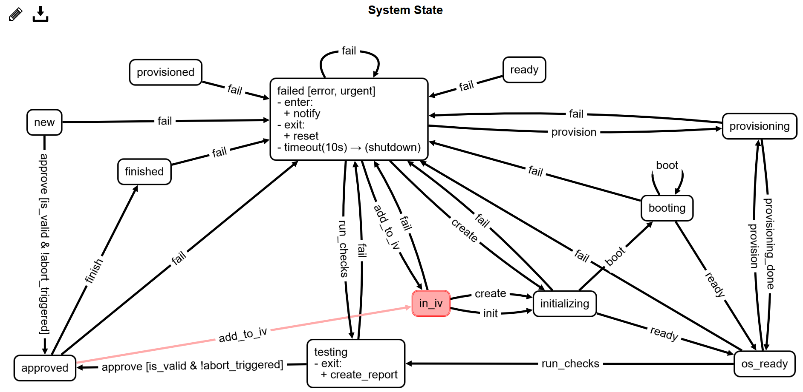
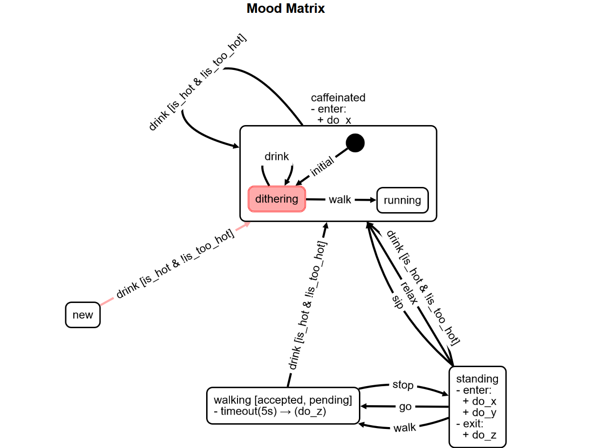
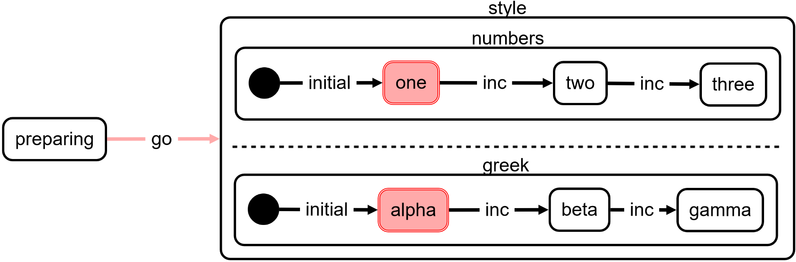

# transitions-gui - A frontend for [transitions](https://github.com/pytransitions/transitions) state machines 
[](https://travis-ci.org/pytransitions/transitions-gui)

An extension for the [transitions](https://github.com/pytransitions/transitions) state machine package.
`transitions-gui` uses [tornado](https://www.tornadoweb.org) as a web server and [cytoscape](http://js.cytoscape.org) for graph drawing and manipulation. For information about the javascript workflow head to [frontend](./frontend).
The server (including the state machine) and client (your web browser) communicate via [WebSockets](https://developer.mozilla.org/en-US/docs/Web/API/WebSockets_API).

***
**Feedback wanted**: Things do not work out of the box? You are not a big fan of the chosen icons, colours, layouts or styles? Now is the time to speak up and file a [new issue](https://github.com/aleneum/transitions-gui/issues/new).
***

## Installation

Install `transitions-gui` from [PyPI](https://pypi.org/project/transitions-gui/)

```bash
pip install transitions-gui
```

or clone the GitHub repo

```bash
# clone the repository
git clone https://github.com/pytransitions/transitions-gui.git
cd transitions-gui
# install transitions-gui and all dependencies
python setup.py install
```

## Quickstart

Let's begin by creating a simple circular state machine.
Running `python examples/simple.py` will execute the following code:

```python
from transitions_gui import WebMachine
import time

states = ['A', 'B', 'C', 'D', 'E', 'F']
# initializing the machine will also start the server (default port is 8080)
machine = WebMachine(states=states, initial='A', name="Simple Machine",
                     ordered_transitions=True,
                     ignore_invalid_triggers=True,
                     auto_transitions=False)

try:
    while True:
        time.sleep(5)
        machine.next_state()
except KeyboardInterrupt:  # Ctrl + C will shutdown the machine
    machine.stop_server()
```

This will create a simple transitions state machine 'ordered' (as in circular) transitions. The name of the machine will be *Simple Machine* and it will act as its own model which is the default behaviour. The initial state is state *A* and every 5 seconds, the state will be changed. Next, open your favourite yet up-to-date web browser and head to [localhost:8080](http://localhost:8080). You should see something similar to this:


The GUI is rather simplistic and contains only two buttons which you can see on the top left:

*  - toggles between *Event Mode* and *Edit Mode*
*  - saves the current layout

### Event Mode

The GUI always starts in *Event Mode* which is represented by the pencil's *white* background. In this mode, the graph can be moved around by clicking and dragging but nodes cannot be moved individually. Clicking an edge/transition in *Event Mode* will dispatch the related trigger to the machine. Give it a try! Clicking any edge should trigger an instant state change. Since all edges trigger the `next_state` event it does not matter which edge you click here.

### Edit Mode

Now let's rearrange some state nodes, shall we? Click the pencil symbol to switch to *Edit Mode* (the pencil's background changes its background) and start dragging that nodes like this:



In *Edit Mode* clicking edges will not trigger an event. However, the machine's model state will be updated regardlessly.
When you are done, switch back to *Event Mode*. Or don't. The mode does not matter for the next step. We will save that layout for the next time we want to run our state machine. Clicking the save button () will store the nodes' current positions in the browser's local storage. Layouts are stored by their name. If you plan to use `transitions-gui` with multiple state machines, it is recommended to make them distinguishable by name. Now reload your browser tab. Your node arangement should be recreated.
Dragging nodes around will not alter the saved layout unless you save it again.

### About layouts

When a transition state machine configuration is sent to the browser, the browser will determine the layout based on the following priority list:

* value of the passed URL argument `layout`
* layout stored in the browsers local storage
* default layout
  - the machine contains *nested states* -> `dagre`
  - otherwise -> `concentric`
  
`transitions-gui` might not choose the right layout for your graph right away. By passing different layout values, you can check which arrangement suits your needs the best. Additionally, you can 'reset' the layout if you want your graph to be automatically arranged again. When `layout=<value>` is passed, the manually stored arrangement is ignored. Check the simple machine with an improved version of the CoSE arangement by opening the GUI with [localhost:8080?layout=bilkent](http://localhost:8080?layout=bilkent). This should look like this:



The currently supported layout values are:

* dagre ([src](https://github.com/cytoscape/cytoscape.js-dagre))
* concentric ([src](http://js.cytoscape.org/#layouts/concentric))
* bilkent ([src](https://github.com/cytoscape/cytoscape.js-cose-bilkent))

This functionality is provided by [cytoscape.js](http://js.cytoscape.org/). If you think `transitions-gui` should support more layouts, feel free to open an issue to propose your favourite layout.

### Show more details

By default, only states and edges are shown.
If you want to annotate `conditions` and `enter/exit` callbacks as well you can pass `details=true` as an URL argument.
This graph (does not make much sense and) has been generated by `examples/process.py`.
You might remember that graph from transitions' documentation.



### NestedWebMachine

In case you want to use hierarchical machines, you need to use `NestedWebMachine` instead of `WebMachine`.
See for instance `examples/hsm.py` or `examples/parallel.py`.

HSM is a slightly tweaked version of the `transitions` example ...



... and `parallel.py` -- as the name suggests -- makes use of parallel states:



By the way, the orientation of the dashed line will change when the parallel state's height is larger than its width.  
This is an experimental solution and might change in the future.


## I have a [bug report/issue/question]...

For bug reports and other issues, please open an issue on GitHub.
